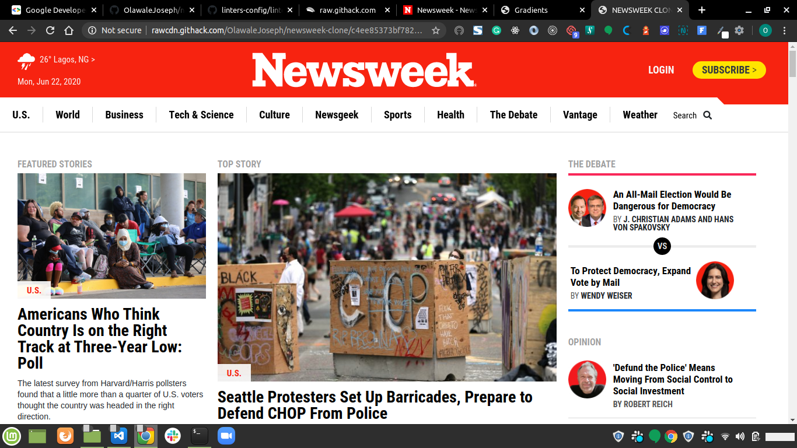

# NEWSWEEK HOME PAGE CLONE

> This is a project that demostartes the use of bootstrap frame work by cloning the home page of a webiste build with bootstrap

Additional description about the project and its features.

## Built With

- HTML5, CSS3
- BOOTSTRAP,
- GIT, STYLELINT, WEBHINT, GITHUB ACTIONS

## Live Demo

[Live Demo Link](https://rawcdn.githack.com/OlawaleJoseph/newsweek-clone/c4ee85373bf782b8cb6e765af0789fb5ae0d217f/index.html)

## Getting Started

**This is an example of how you may give instructions on setting up your project locally.**
**Modify this file to match your project, remove sections that don't apply. For example: delete the testing section if the currect project doesn't require testing.**

To get a local copy up and running follow these simple example steps.

### Prerequisites
- GIT
- BROWSER

### Setup
- Clone this repo
- cd into the cloned repo
- Open the index.html file with any browser of your choice 

### Deployment
- This simple webpage can be deployed on any web hosting platform

## Authors

👤 **Author1**

- Github: [@githubhandle](https://github.com/OlawaleJoseph)
- Twitter: [@twitterhandle](https://twitter.com/javanode123)
- Linkedin: [linkedin](www.linkedin.com/in/olawale-adedeko)

## 🤝 Contributing

Contributions, issues and feature requests are welcome!

Feel free to check the [issues page](https://github.com/OlawaleJoseph/newsweek-clone/issues).

## Show your support

Give a ⭐️ if you like this project!

## Acknowledgments

- BOOTSTRAP TEAM
- MICROVERSE

## 📝 License

This project is [MIT](lic.url) licensed.
